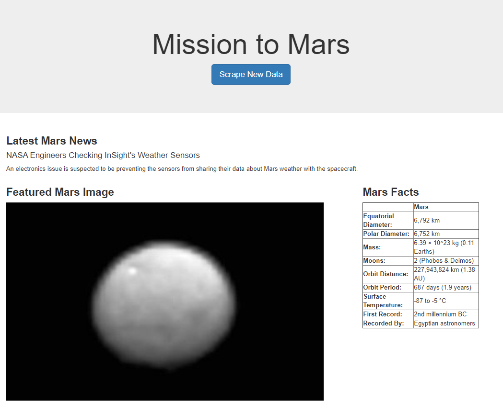
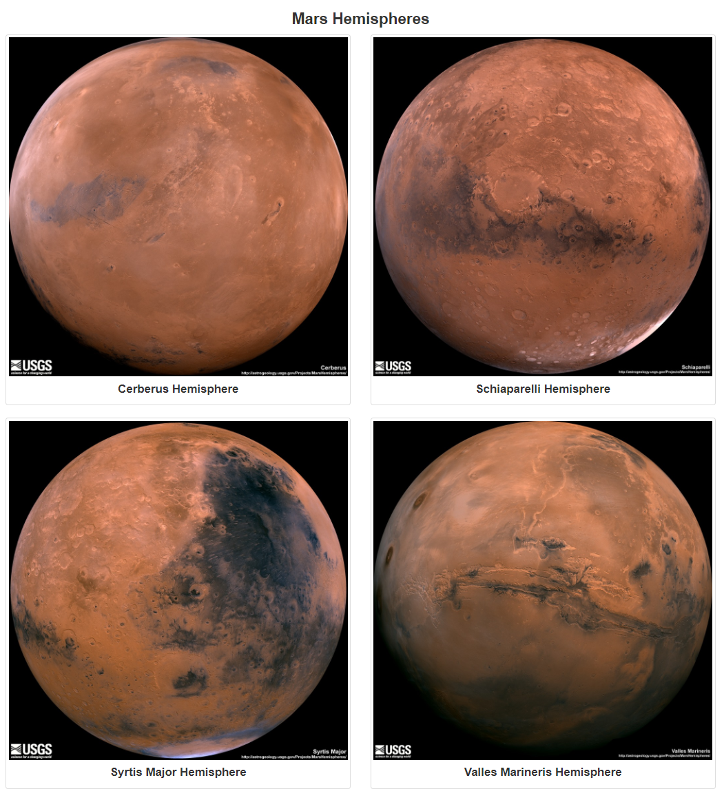

# web-scraping-challenge
 Jamie Tan submission on web scraping challenge

### Background of the challenge:

This challenge requires us to build a web application that scrapes various websites for data related to the Mission to Mars and displays the information in a single HTML page.
* Web scraping is performed using Jupyter Notebook, BeautifulSoup, Pandas and Requests/Splinter
* Data visualisation via HTML using MongoDB and Flask application

### Final application:

### Submission (within 'Mission to Mars' folder):
1. Jupyter Notebook (filename: mission_to_mars.ipynb)
2. Python scrape function (filename: scrape_mars.py)
3. Flask app to query MongoDB and pass data into a HTML template (filename: app.py)
4. HTML template (filename: index.html; in folder 'templates')
5. Screenshots of HTML page and final application (in folder 'screenshots')
